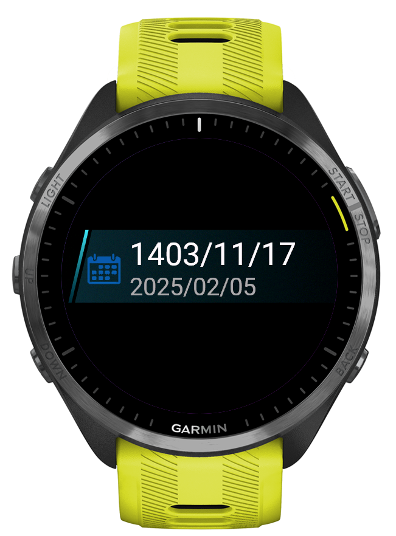

# Persian Calendar for Garmin Watch

This project provides a Persian (Jalali) calendar for Garmin watches. The calendar is implemented as a widget that can be installed on compatible Garmin devices.

## Features

- Display the current Persian date
- Display the current Gregorian date
- Navigate through the calendar using the up and down buttons

## Screenshots

## Contributing

Contributions are welcome! Please follow these steps to contribute:

1. Fork the repository.
2. Create a new branch for your feature or bugfix.
3. Commit your changes and push them to your fork.
4. Create a pull request with a detailed description of your changes.

## License

This project is licensed under the MIT License. See the [LICENSE](LICENSE) file for details.

## Contact

For any questions or feedback, please open an issue
