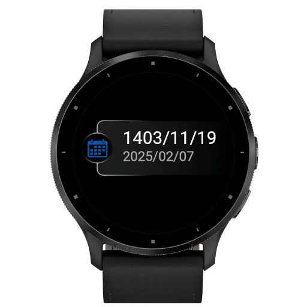
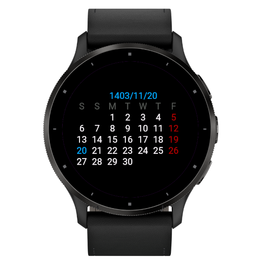

# Persian Calendar for Garmin Watch

This project provides a Persian (Jalali) calendar for Garmin watches. The calendar is implemented as a widget that can be installed on compatible Garmin devices.

## Features

- Display the current Persian date
- Display the current Gregorian date
- Navigate through the calendar using the up and down buttons

## Screenshots






## Contributing

Contributions are welcome! Please follow these steps to contribute:

1. Fork the repository.
2. Create a new branch for your feature or bugfix.
3. Commit your changes and push them to your fork.
4. Create a pull request with a detailed description of your changes.

## Manual Deployment

Copy the `.prg` file to the `/GARMIN/APPS/` directory on your Garmin device.

## Script: create_drawables.sh

The `create_drawables.sh` script is used to create directories for different icon sizes and resize the launcher icon accordingly. It uses ImageMagick to resize the images. The script performs the following steps:

1. Defines a list of directories to create along with their icon sizes.
2. Checks if the template directory exists.
3. Defines a function to resize images using ImageMagick.
4. Creates directories, copies template files, and resizes images.

To run the script, use the following command:

```sh
./resources/create_drawables.sh
```

## Todo

- Fix UI bug for forrunner 55
- Improve Gregorian toggle (Handle physical key)
- Cover more devices

## Related document

- https://developer.garmin.com/connect-iq/reference-guides/devices-reference/#devicereference
- https://developer.garmin.com/connect-iq/compatible-devices/

## License

This project is licensed under the MIT License. See the [LICENSE](LICENSE) file for details.

## Contact

For any questions or feedback, please open an issue
